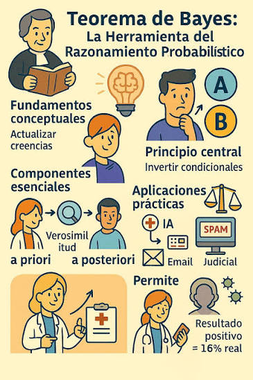

# Unidad 2 — Inferencia probabilística y aprendizaje bayesiano

## Teorema de Bayes

### Introducción

En la unidad anterior aprendimos a construir distribuciones de probabilidad a partir de datos observados y a ajustar modelos probabilísticos mediante distribuciones paramétricas.

Sin embargo, en muchos problemas reales no conocemos con certeza cuál es el valor correcto de una probabilidad o de un parámetro. A medida que obtenemos nueva evidencia, nuestras creencias deben modificarse.

La inferencia bayesiana proporciona un marco matemático para realizar esta actualización de conocimiento.

La idea fundamental es sencilla:

> Aprender consiste en modificar probabilidades a partir de nueva evidencia.

---

### El problema de la inferencia

Supongamos que queremos determinar si una moneda es justa.

La probabilidad de obtener cara es:

$$
\theta=P(\text{cara})
$$

Inicialmente desconocemos el valor de $\theta$.

Podríamos preguntarnos:

* ¿Es una moneda justa?
* ¿Está sesgada?
* ¿Qué tan seguros estamos de nuestra respuesta?

La respuesta dependerá de la evidencia observada.

---

### Probabilidad condicional

Recordemos que la probabilidad condicional se define como:

$$
P(A|B)
=
\frac{P(A \cap B)}
{P(B)}
$$

Esta expresión representa la probabilidad de que ocurra el evento (A) cuando sabemos que el evento (B) ya ocurrió.

---

### Derivación del Teorema de Bayes

Podemos escribir:

$$
P(A \cap B)
=
P(A|B)P(B)
$$

y también:

$$
P(A \cap B)
=

P(B|A)P(A)
$$

Igualando ambas expresiones obtenemos:

$$
P(A|B)
=

\frac{P(B|A)P(A)}
{P(B)}
$$

Esta ecuación recibe el nombre de **Teorema de Bayes**.

---

### Interpretación

La ecuación anterior puede leerse como:

```text
Creencia inicial
        ×
Compatibilidad con la evidencia
        ↓
Creencia actualizada
```

o de forma más compacta:

```text
Prior
   ×
Likelihood
   ↓
Posterior
```

---

### Componentes de Bayes

#### Prior

$$
P(A)
$$

Representa nuestra creencia antes de observar la evidencia.

---

#### Likelihood

$$
P(B|A)
$$

Representa qué tan compatible es la evidencia con la hipótesis considerada.

---

#### Evidencia

$$
P(B)
$$

Actúa como constante de normalización.

Garantiza que las probabilidades finales sumen uno.

---

#### Posterior

$$
P(A|B)
$$

Representa nuestra creencia después de observar la evidencia.

Es el resultado final del proceso de aprendizaje.

### Ejemplos del teorema de Bayes

* Se tienen dos cajas, la primera contiene 3 bolas rojas y 2 azules mientras que la segunda contiene 2 rojas y 8 azules. Se lanza una moneda, si se obtiene cara se saca una bola de la primera caja y si se obtiene sello se saca una bola de la segunda. Si se sabe que la bola obtenida es azul, ¿cuál es la probabilidad de que provenga de la primera caja?
* Utilizando los mismos datos del ejercicio anterior,  si se sabe que la bola obtenida es roja, ¿cuál es la probabilidad de que provenga de la segunda caja?
* Se tienen dos cajas, la primera contiene 3 bolas rojas y 2 azules mientras que la segunda contiene 2 rojas y 8 azules. Se lanza un dado, si se obtiene 1 ó 2 se saca una bola de la primera caja y si se obtiene 3, 4, 5 ó 6 se saca una bola de la segunda. Si se sabe que la bola obtenida es azul, ¿cuál es la probabilidad de que provenga de la primera caja?
* En cierto colegio el 12% de los alumnos utilizan IA para realizar sus trabajos escolares. Un profesor utiliza un detector de uso de IA que acierta el 90% cuando el trabajo fue hecho con IA y que falla un 5% cuando el trabajo no fue realizado con IA. Si el profesor recibe el resultado de que el trabajo fue realizado con IA, ¿cuál es la probabilidad de estar equivocado?
* En un restaurante de comida rápida el 30% de los clientes es infantil. Se tienen dos combos a la venta, siendo el combo 1 elegido un 60% por los niños y un 20% por los adultos. Si la orden entregada es un combo 2, ¿cuál es la probabilidad de que el pedido sea para un niño?
* La probabilidad de que haya un accidente en una fábrica que dispone de alarma es 0.1. La probabilidad de que suene esta sí se ha producido algún incidente es de 0.97 y la probabilidad de que suene si no ha sucedido ningún incidente es 0.02. En el supuesto de que haya funcionado la alarma, ¿cuál es la probabilidad de que no haya habido ningún incidente?
* Un análisis de sangre de laboratorio tiene una eficacia del 95% para detectar una determinada enfermedad cuando, de hecho, está presente. Sin embargo, la prueba también arroja un resultado "falso positivo" para el 1% de las personas sanas analizadas. (Es decir, si se hace la prueba a una persona sana, entonces, con una probabilidad de 0.01 el resultado de la prueba implicará que tiene la enfermedad). Si el 5% de la población en realidad tiene la enfermedad, ¿cuál es la probabilidad de que una persona tiene la enfermedad dado que el resultado de la prueba es positivo?
* En una cierta etapa de una investigación criminal, el inspector a cargo está convencido en un 60% de la culpabilidad de cierto sospechoso. Supongamos, sin embargo, que se descubre una nueva prueba que muestra que el delincuente tiene una determinada característica. Si el 20% de la población posee esta característica, ¿qué tan seguro debe estar el inspector de la culpabilidad del sospechoso ahora si resulta que el sospechoso tiene esta característica?
* Una fábrica de clavos dispone de 2 máquinas que elaboran el 30% y 70% de los clavos que producen. El porcentaje de clavos defectuosos de cada máquina es del 2% y 3%, respectivamente. Si se selecciona al azar un clavo de la producción y este fue defectuoso, ¿cuál es la probabilidad de que haya sido fabricado por la máquina 1?
* El 20% de los empleados de una empresa son ingenieros y otro 20% son economistas. El 75% de los ingenieros ocupan un puesto directivo y el 50% de los economistas también, mientras que los no ingenieros y los no economistas solamente el 20% ocupa un puesto directivo. ¿Cuál es la probabilidad de que un empleado directivo elegido al azar sea ingeniero?

---

Mirar un libro que presenta la forma como va ganando información a partir del teorema de Bayes [Libro Bayes Embarazo](./ejemplo_bayes_embarazo.ipynb)

## Aprender como actualización de probabilidades

<center>

</center>


Muy importante, mirar este ilustrativo video: [Video](https://www.youtube.com/watch?v=D7KKlC0LOyw)

La interpretación moderna de Bayes consiste en entender el aprendizaje como un proceso continuo de actualización.

Cada nueva observación:

* aporta información,
* elimina hipótesis poco plausibles,
* incrementa la plausibilidad de otras hipótesis.

En lugar de producir respuestas absolutas, Bayes produce distribuciones de probabilidad que reflejan distintos niveles de incertidumbre.

---

### Priors y Posteriors

#### Prior

Antes de observar datos tenemos una distribución de creencias.

Por ejemplo, si desconocemos completamente el comportamiento de una moneda, podríamos considerar igualmente plausibles todos los valores:

$$
0 \le \theta \le 1
$$

Una forma de representar esta situación es mediante:

$$
\theta \sim Beta(1,1)
$$

que corresponde a una distribución uniforme.

---

#### Posterior

Ahora observamos:

* 8 caras
* 2 sellos

La evidencia sugiere que valores cercanos a:

$$
\theta \approx 0.8
$$

son más plausibles que valores cercanos a 0.2.

La distribución posterior se concentra alrededor de dichos valores.

---

#### Mismo valor esperado, distinta incertidumbre

Supongamos dos situaciones:

##### Caso 1

Observamos:

* 1 cara
* 1 sello

Posterior:

$$
Beta(2,2)
$$

---

##### Caso 2

Observamos:

* 100 caras
* 100 sellos

Posterior:

$$
Beta(101,101)
$$

---

En ambos casos la media es aproximadamente:

$$
\theta=0.5
$$

pero la incertidumbre es muy diferente.

La segunda distribución es mucho más concentrada.

Esto ilustra una idea fundamental:

> La evidencia no solamente modifica nuestras probabilidades; también modifica nuestra incertidumbre.

---

## Experimento de Bayes: la moneda izquierda-derecha

### Descripción

Este experimento fue utilizado por Thomas Bayes para ilustrar el proceso de inferencia.

Se coloca una primera moneda aleatoriamente sobre una mesa.

La posición exacta de dicha moneda es desconocida.

Llamaremos:

$$
\theta
$$

a la posición relativa de la moneda medida entre el borde izquierdo y el borde derecho de la mesa.

---

### Incertidumbre inicial

Antes de observar cualquier dato, cualquier posición es igualmente plausible.

Por tanto:

$$
\theta \sim Uniforme(0,1)
$$

La incertidumbre es máxima.

---

### Obtención de evidencia

Posteriormente se lanzan nuevas monedas sobre la mesa.

No observamos su posición exacta.

Únicamente registramos si caen:

* a la izquierda de la moneda original,
* o a la derecha de la moneda original.

Por ejemplo:

```text
L, L, R, L, R, R, L
```

---

### Construcción de evidencia

Si observamos:

* $n_L$ monedas a la izquierda,
* $n_R$ monedas a la derecha,

la probabilidad de observar esos resultados depende de la posición de la moneda original.

---

### Distribución posterior

Puede demostrarse que la distribución posterior es:

$$
\theta
\sim
Beta(n_L+1,;n_R+1)
$$

---

### Interpretación

La posición más probable de la moneda no depende únicamente de la proporción izquierda-derecha.

También depende de la cantidad de observaciones.

Por ejemplo:

#### Caso A

$$
n_L=1
$$

$$
n_R=1
$$

Posterior:

$$
Beta(2,2)
$$

Existe gran incertidumbre.

---

#### Caso B

$$
n_L=100
$$

$$
n_R=100
$$

Posterior:

$$
Beta(101,101)
$$

La media sigue siendo 0.5, pero la incertidumbre es mucho menor.

---

### Relación con el curso

Este experimento resume gran parte de las ideas fundamentales que estudiaremos:

```text
Datos
    ↓
Probabilidades
    ↓
Evidencia
    ↓
Actualización
    ↓
Reducción de incertidumbre
```

La inferencia bayesiana puede interpretarse como un mecanismo matemático para transformar evidencia en conocimiento.

Mira la simulación del experimento de Bayes en el siguiente libro: [Libro Experimento Bayes](./modelo_bayes.ipynb)

---

## Distribución Beta y reducción de incertidumbre

En la sección anterior estudiamos el Teorema de Bayes y observamos cómo una nueva evidencia permite modificar nuestras creencias sobre una hipótesis. Sin embargo, aún no hemos discutido cómo representar matemáticamente la incertidumbre asociada a una probabilidad desconocida.

La distribución Beta surge precisamente para resolver este problema.

Supongamos que queremos estimar la probabilidad:

$$
\theta = P(\text{éxito})
$$

Por ejemplo:

* Probabilidad de que una moneda produzca cara.
* Probabilidad de que un pasajero sobreviva.
* Probabilidad de que un estudiante apruebe un examen.
* Probabilidad de que un cliente realice una compra.

Inicialmente desconocemos el valor de (\theta). No sabemos si vale:

$$
0.2,\quad 0.5,\quad 0.8
$$

o cualquier otro valor entre 0 y 1.

La distribución Beta permite describir qué tan plausibles consideramos los distintos valores de dicha probabilidad.

---

### Distribución Beta

La distribución Beta depende de dos parámetros: $\alpha$ y $\beta$

y posee función de densidad:

$$
f(\theta)=
\frac{\theta^{\alpha-1}(1-\theta)^{\beta-1}}
{B(\alpha,\beta)}
$$

para:

$$
0 \le \theta \le 1
$$

donde:

$$
B(\alpha,\beta)
$$

es una constante de normalización.

---

### Interpretación de los parámetros

Intuitivamente:

* $\alpha$ representa evidencia acumulada a favor del éxito.
* $\beta$ representa evidencia acumulada a favor del fracaso.

Por esta razón, al observar:

* $n_E$ éxitos,
* $n_F$ fracasos,

la distribución posterior toma la forma:

$$
Beta(n_E+1,n_F+1)
$$

---

### Ejemplo

Supongamos que lanzamos una moneda y observamos:

* 3 caras.
* 1 sello.

La distribución posterior será:

$$
Beta(4,2)
$$

La mayor parte de la probabilidad se concentra alrededor de valores cercanos a:

$$
\theta \approx 0.67
$$

pero todavía existe incertidumbre.

---

### El papel de la evidencia

Ahora comparemos dos situaciones:

#### Caso 1

* 3 caras.
* 1 sello.

$$
Beta(4,2)
$$

#### Caso 2

* 300 caras.
* 100 sellos.

$$
Beta(301,101)
$$

En ambos casos la proporción observada es aproximadamente:
$$
0.75
$$

Sin embargo, la segunda distribución es mucho más estrecha.

Esto significa que nuestra incertidumbre es considerablemente menor.

---

### Aprender como reducción de incertidumbre

La media de la distribución Beta nos indica cuál es el valor más probable del parámetro.

La dispersión de la distribución nos indica qué tan seguros estamos de dicha estimación.

Por esta razón, el aprendizaje puede interpretarse como un proceso de reducción progresiva de incertidumbre.

A medida que aumenta el número de observaciones:

* La distribución posterior se concentra.
* La varianza disminuye.
* La incertidumbre disminuye.

Es importante notar que la incertidumbre que disminuye no es la incertidumbre del fenómeno observado, sino la incertidumbre que tenemos acerca de sus parámetros.


---

## Likelihood y Maximum Likelihood

En la unidad anterior aprendimos a construir distribuciones empíricas a partir de datos observados y a compararlas con modelos teóricos mediante medidas como la divergencia KL y pruebas de bondad de ajuste.

Ahora surge una nueva pregunta:

> Si conocemos la forma de una distribución, ¿cómo encontramos los valores de sus parámetros?

La respuesta se encuentra en el concepto de verosimilitud o likelihood.

---

### El problema

Supongamos que observamos los siguientes datos:

$$
x_1,x_2,\ldots,x_n
$$

y creemos que provienen de una distribución:

$$
q(x;\theta)
$$

donde:

$$
\theta
$$

representa parámetros desconocidos.

Por ejemplo:

* En una Bernoulli, $\theta=p$.
* En una Poisson, $\theta=\lambda$.
* En una Normal, $\theta=(\mu,\sigma)$.

Nuestro objetivo es estimar dichos parámetros.

---

### Likelihood

La likelihood responde a la siguiente pregunta:

> Si los parámetros fueran $\theta$, ¿qué tan probable sería observar los datos obtenidos?

La función de verosimilitud se define como:

$$
L(\theta)
=
P(x_1,x_2,\ldots,x_n|\theta)
$$

Si suponemos observaciones independientes:

$$
L(\theta)
=
\prod_{i=1}^{n}
q(x_i;\theta)
$$

---

### Interpretación

Es importante destacar que la likelihood no es una distribución de probabilidad sobre $\theta$.

Los datos ya fueron observados.

La likelihood mide qué tan compatibles son los datos con distintos valores posibles de los parámetros.

---

### Ejemplo: moneda

Supongamos que observamos:

* 8 caras.
* 2 sellos.

Si proponemos:

$$
\theta=P(\text{cara})
$$

la likelihood será:

$$
L(\theta)
=

\theta^8(1-\theta)^2
$$

Algunos valores de $\theta$ explicarán mejor los datos que otros.

Por ejemplo:

* $\theta=0.8$ produce una likelihood alta.
* $\theta=0.2$ produce una likelihood muy baja.

---

### Maximum Likelihood Estimation (MLE)

La estimación por máxima verosimilitud consiste en encontrar el valor de los parámetros que maximiza la likelihood:

$$
\theta^*
=

\arg\max_{\theta}
L(\theta)
$$

En palabras:

> Elegimos los parámetros que hacen que los datos observados sean lo más probables posible.

---

### Log-Likelihood

Debido a que la likelihood suele involucrar productos muy grandes, normalmente se utiliza su logaritmo:

$$
\ell(\theta)
=

\log L(\theta)
$$

Utilizando propiedades de los logaritmos:

$$
\ell(\theta)
=

\sum_i
\log q(x_i;\theta)
$$

Esto simplifica considerablemente los cálculos.

---

### Ejemplo: Maximum Likelihood para una moneda

Supongamos que lanzamos una moneda 10 veces y observamos:

* 8 caras.
* 2 sellos.

Deseamos estimar:

$$
\theta=P(\text{cara})
$$

---

### Función de Likelihood

Cada lanzamiento puede modelarse mediante una distribución Bernoulli:

$$
X_i \sim Bernoulli(\theta)
$$

Como los lanzamientos son independientes:

$$
L(\theta)
=

\prod_{i=1}^{10}
P(x_i|\theta)
$$

En nuestro experimento observamos:

* 8 éxitos (caras),
* 2 fracasos (sellos).

Por lo tanto:

$$
L(\theta)
=

\theta^8(1-\theta)^2
$$

Esta función indica qué tan compatibles son distintos valores de (\theta) con los datos observados.

Por ejemplo:

* $\theta=0.8$ produce una likelihood alta.
* $\theta=0.2$ produce una likelihood muy baja.

---

### Log-Likelihood

Para facilitar los cálculos tomamos logaritmos:

$$
\ell(\theta)
=

\log L(\theta)
$$

Entonces:

$$
\ell(\theta)
=

\log\left(
\theta^8(1-\theta)^2
\right)
$$

Aplicando propiedades de los logaritmos:

$$
\ell(\theta)
=

8\log(\theta)
+
2\log(1-\theta)
$$

Esta función posee exactamente el mismo máximo que la likelihood original.

---

### Maximización

Para encontrar el valor óptimo derivamos respecto a (\theta):

$$
\frac{d\ell}{d\theta}
=

 \frac{8}{\theta}
-
\frac{2}{1-\theta}
$$

Buscamos los puntos críticos:

$$
\frac{8}{\theta}
-
 \frac{2}{1-\theta}
=
0
$$

Lo que lleva a la solución: 

$$
\theta^*
=\frac{8}{10}
=
0.8
$$

### Resultado

La estimación de máxima verosimilitud es:

$$
\hat\theta_{MLE}
=
0.8
$$

Es decir:

$$
P(\text{cara})
=

0.8
$$
---

### Relación con la inferencia bayesiana

Es importante notar una diferencia fundamental entre Maximum Likelihood e Inferencia Bayesiana.

Maximum Likelihood produce un único valor:

$$
\theta=0.8
$$

La inferencia bayesiana produce una distribución completa sobre los posibles valores de (\theta):

$$
\theta
\sim
Beta(9,3)
$$

Ambos enfoques utilizan los mismos datos, pero responden preguntas diferentes.

```text
Maximum Likelihood:
¿Cuál es el valor más probable de θ?

Bayes:
¿Cuál es la distribución de probabilidad completa de θ?
```

En las siguientes secciones veremos que ambos enfoques están profundamente relacionados y que, cuando el número de observaciones aumenta, sus resultados tienden a converger.


---
### Relación con la divergencia KL

Existe una conexión profunda entre Maximum Likelihood y la teoría de la información.

Cuando el tamaño de muestra es suficientemente grande, maximizar la likelihood equivale a minimizar la divergencia KL entre:

$$
\hat p(x)
$$

y

$$
q(x;\theta)
$$

Es decir, los parámetros obtenidos por MLE son aquellos que producen la menor distancia informacional entre el modelo y los datos observados.

---

### Interpretación moderna

La mayor parte del aprendizaje estadístico y del aprendizaje automático puede entenderse como una extensión de esta idea.

El proceso general es:

```text
Datos observados
        ↓
Modelo paramétrico
        ↓
Likelihood
        ↓
Estimación de parámetros
        ↓
Mejor ajuste posible
```

Desde esta perspectiva, aprender consiste en encontrar los parámetros que mejor explican la evidencia disponible.


---

## Clasificador Bayesiano Naive

Hasta ahora hemos estudiado cómo Bayes permite estimar parámetros desconocidos y actualizar nuestras creencias a medida que obtenemos nueva evidencia.

Sin embargo, en muchos problemas de aprendizaje automático el objetivo no consiste en estimar un parámetro, sino en decidir a cuál de varias categorías pertenece una nueva observación.

Por ejemplo:

* ¿Este correo corresponde a spam o no spam?
* ¿La imagen contiene un gato o un perro?
* ¿Un paciente presenta o no una determinada enfermedad?
* ¿Un pasajero sobrevivirá o no al accidente?

En todos estos casos buscamos calcular la probabilidad de una clase a partir de un conjunto de características observadas.

---

### El problema de la clasificación

Supongamos que observamos una muestra descrita mediante varias variables:

$$
X=(x_1,x_2,\ldots,x_n)
$$

y queremos determinar a cuál clase pertenece.

Por ejemplo, si deseamos clasificar un correo electrónico, algunas características podrían ser:

* contiene la palabra "oferta",
* contiene enlaces,
* número de imágenes,
* longitud del mensaje.

Nuestro objetivo consiste en calcular:

$$
P(C_k|X)
$$

es decir, la probabilidad de que la muestra pertenezca a la clase \(C_k\) dadas las características observadas.

---

### Aplicando el Teorema de Bayes

Utilizando el Teorema de Bayes obtenemos:

$$
P(C_k|X)
=
\frac{P(X|C_k)\,P(C_k)}
{P(X)}
$$

donde:

* \(P(C_k)\) representa la probabilidad *a priori* de cada clase.
* \(P(X|C_k)\) mide qué tan compatibles son las características observadas con dicha clase.
* \(P(X)\) actúa como constante de normalización.

Al comparar varias clases, el término \(P(X)\) es el mismo para todas ellas, por lo que basta con evaluar:

$$
P(X|C_k)\,P(C_k)
$$

y seleccionar la clase que produzca el mayor valor.

---

### El supuesto "naive"

El principal inconveniente aparece al calcular la probabilidad conjunta:

$$
P(x_1,x_2,\ldots,x_n|C_k)
$$

Cuando el número de variables aumenta, estimar esta distribución requiere una enorme cantidad de datos.

El clasificador **Naive Bayes** propone entonces una simplificación muy importante:

> Suponer que todas las variables son condicionalmente independientes una vez conocida la clase.

Bajo esta hipótesis,

$$
P(X|C_k)
=
\prod_{i=1}^{n}
P(x_i|C_k)
$$

Esta es precisamente la razón del nombre *naive* ("ingenuo"): se asume una independencia que, en muchos problemas reales, no es completamente cierta.

Sorprendentemente, aun cuando esta hipótesis no se cumple de manera exacta, el clasificador suele ofrecer resultados muy competitivos.

---

### Regla de decisión

Finalmente, la clasificación consiste en elegir la clase cuya probabilidad posterior sea mayor:

$$
\hat C
=
\arg\max_{C_k}
P(C_k)
\prod_i
P(x_i|C_k)
$$

En otras palabras, se selecciona la clase que mejor explica simultáneamente todas las características observadas.

---

### Relación con el aprendizaje bayesiano

Aunque Naive Bayes utiliza el mismo Teorema de Bayes que hemos estudiado anteriormente, responde a una pregunta diferente.

En la inferencia bayesiana estimábamos parámetros desconocidos de un modelo probabilístico.

En Naive Bayes suponemos que esos modelos ya han sido aprendidos y los utilizamos para decidir cuál es la clase más probable de una nueva observación.

Podemos resumir el proceso de la siguiente manera:

```text
Datos de entrenamiento
          ↓
Estimación de probabilidades
          ↓
Modelo probabilístico
          ↓
Nueva observación
          ↓
Aplicación del Teorema de Bayes
          ↓
Clase más probable
```

De esta forma, Naive Bayes constituye uno de los clasificadores probabilísticos más sencillos, rápidos y utilizados, especialmente cuando el número de variables es elevado.

---

## Smoothing y soporte probabilístico

Existe, sin embargo, un problema práctico que aparece con frecuencia al construir un clasificador Naive Bayes.

Supongamos que durante el entrenamiento nunca observamos una determinada característica dentro de una clase.

Por ejemplo, imaginemos que en todos los correos clasificados como **spam** nunca apareció la palabra **universidad**.

La probabilidad estimada sería entonces:

$$
P(\text{universidad}|\text{spam})=0
$$

Como Naive Bayes multiplica todas las probabilidades,

$$
P(X|C_k)
=
\prod_i P(x_i|C_k),
$$

basta con que uno de los factores sea cero para que toda la probabilidad de esa clase también sea cero.

En consecuencia, una única característica no observada podría descartar completamente una clase, aun cuando toda la evidencia restante apunte hacia ella.

---

### Suavizado (Smoothing)

Para evitar este problema se emplea una técnica conocida como **suavizado** (*smoothing*).

La idea consiste en asumir que una probabilidad nunca debe ser exactamente cero únicamente porque no haya aparecido en la muestra de entrenamiento.

La estrategia más utilizada es el **suavizado de Laplace**, que añade una pequeña cantidad ficticia de evidencia a cada posible resultado.

En lugar de estimar

$$
P(x_i|C_k)
=
\frac{n_i}{N},
$$

se utiliza

$$
P(x_i|C_k)
=
\frac{n_i+1}{N+K},
$$

donde:

* \(n_i\) es el número de observaciones de esa característica.
* \(N\) es el número total de ejemplos pertenecientes a la clase.
* \(K\) representa el número de valores posibles que puede tomar la característica.

De esta forma, todas las probabilidades permanecen positivas y el clasificador continúa siendo capaz de incorporar nueva evidencia.

---

### Soporte probabilístico

El concepto de **soporte probabilístico** está estrechamente relacionado con la idea del suavizado.

Decimos que una distribución asigna soporte a todos los eventos que considera posibles.

Cuando una probabilidad vale exactamente cero, el modelo está afirmando que dicho evento es imposible.

En la práctica, una ausencia de observaciones no implica necesariamente imposibilidad; simplemente significa que aún no hemos reunido suficiente evidencia.

El suavizado amplía el soporte del modelo, permitiendo asignar una pequeña probabilidad a eventos no observados y evitando conclusiones excesivamente categóricas.

Esta idea resulta coherente con toda la filosofía de la inferencia bayesiana desarrollada en este capítulo.

Desde el punto de vista bayesiano, aprender no consiste en descartar hipótesis de manera absoluta, sino en modificar gradualmente nuestras creencias a medida que aparece nueva evidencia. El suavizado refleja precisamente esta filosofía: incluso cuando nunca hemos observado un determinado evento, mantenemos abierta la posibilidad de que pueda ocurrir en el futuro, asignándole una probabilidad pequeña, pero diferente de cero.

De esta manera, el clasificador Naive Bayes no solo resulta sencillo de implementar y computacionalmente eficiente, sino que además conserva uno de los principios fundamentales de la inferencia probabilística: **la incertidumbre nunca desaparece completamente; simplemente disminuye a medida que aumenta la evidencia disponible.**

Mirar un ejemplo de Naive Bayes para clasificación: [Libro Naive Bayes](./naive_bayes.ipynb)